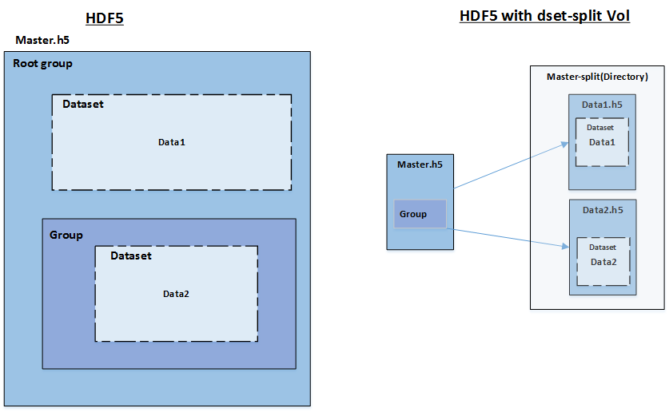
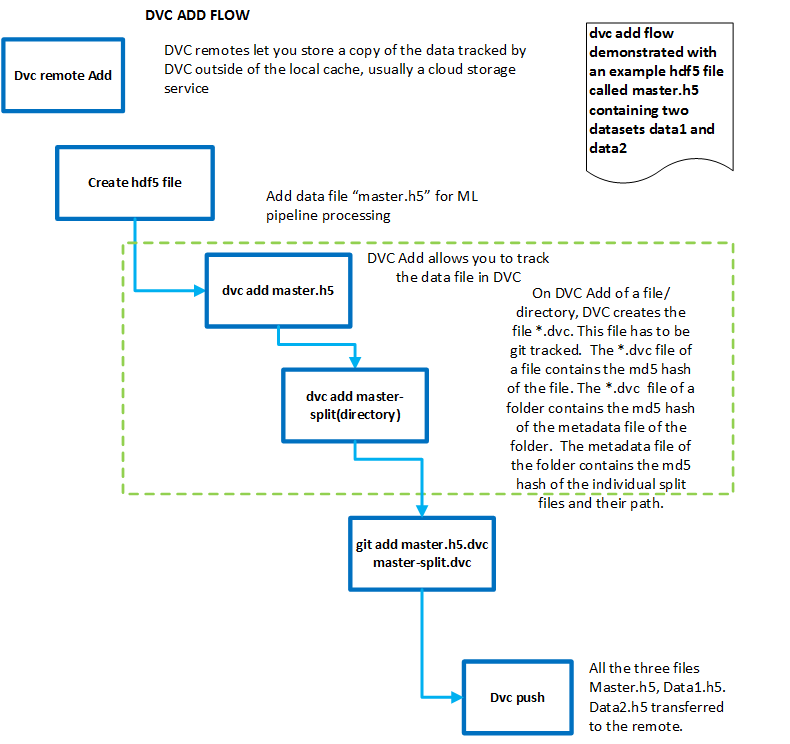

# HDF5 Versioning with Data Version Control (DVC).

DVC is a data and ML experiment management tool which allows managing datasets, models and code together. Among other features, it provides reproducibility and data provenance to track the evolution of machine learning models. DVC allows tracking the versions of datasets for full reproducibility, however the tracking provided by DVC is at file level. This creates high overheads in huge files like HDF5 where a single file can host multiple datasets. Changes in any one of the dataset would cause the entire file to be duplicated resulting in suboptimal utilization of storage and network bandwidth.
 
The 'dset-split' Vol connector creates separate file for each individual dataset created in the main file (the file explicitly created from the application) and mounts it on the main file as external links. The individual dataset files  ("split files") are created inside a directory named "filename-split" at the same hierarchy as the main file. This allows grouping together all the split files associated with a file into a single containing directory. Since DVC tracks changes at a file granularity, creating seperate files for individual dataset, helps to track the changes at dataset level and enables versioning of HDF5 files at a dataset boundary.

The main file and the directory containing each individual dataset files can be managed as a single unit with the read and write operations happening transparently using the main file handle. The main file and the folder containing the splitfiles are tracked explicitly in DVC. DVC internally tracks each of the dataset files in the splitfile folder for changes. When a dataset changes, only the individual dataset file and main file needs to be duplicated. The files hosting the other datasets which are part of the main file in unchanged hence not duplicated. This increases the storage and bandwidth efficiency, when versioning large HDF5 files.    

## How Version tracking happens in DVC. 
Data version control relies on Git for version tracking.
The data files and source files of ML Experiments are stored separately. Data files are version tracked using their metadata file. A metadata file (.dvc file) is created for every data file/directory, and this metadata file is versioned using git and checked in into the git repository. The source files and metadata files are stored in git repository and version controlled using git. The data files are stored in the remote backend storage. DVC supports the following remote storage types: Google Drive, Amazon S3, Azure Blob Storage, Google Cloud Storage, Aliyun OSS, SSH, HDFS, and HTTP.

Dvc "add" command is used to track a file/directory in DVC. DVC stores information about the added file (or a directory) in a special .dvc file, named \<filename\>.dvc. It is a small text file with a human-readable format. This file can be easily versioned like source code with Git. It acts as a placeholder for the original data (which gets listed in .gitignore).

To track a data file/directory, the user should do a dvc add command. This will create a *.dvc file which should be added and committed to git. The user can use the dvc push to send the new data to the remote data storage. When there is a change in data, the dvc add command is invoked again, which will cause the new md5sha to be added in the .dvc file. The new version of the *.dvc file should be added and committed to git. 
In summary, versioning of the data, happens through the versioning of *.dvc file, which contains the latest md5 hash of the data. 

   

Fig:1 Versioning with DVC 

 
### Present Challenges with DVC- HDF5 interaction  
•	DVC is not aware of the underlying hierarchy of data objects and treats the entire hdf5 file as a blob. Due to this any change in any of the datasets would result in fetching the entire file (which usually runs into a few GB’s).

•	A change in any dataset will result in the re-run of the pipeline, even if the participating dataset has been unchanged.

•	Data storage – Entire data gets duplicated among the various versions resulting in occupying more backend storage.

### Dataset Split Approach

HDF5 files are split into a main file and data files. Separate data files are created for each of the dataset created in the main file. The individual dataset files ("split files") are created inside a directory named "filename-split" at the same hierarchy as the main file. This allows grouping together all the split files associated with a file into a single containing directory. Each individual dataset file is linked to the main file with an external link. This allows data to be managed at a dataset boundary. 
When an application creates a HDF5 file, the underneath hdf5 library, with the help of a dset-split vol connector, will create individual datasets as separate files inside the containing directory. The dataset file is mounted on the main file as external links.

Any dataset created on the master file will result in a separate HDF5 file linked to the main master under the same hierarchy inside the HDF5 file using an external link.
This is transparent for the applications. Applications would still work on the main file as regular HDF5 and any operations on the underlying datasets would get executed on the underlying dataset file by the dset-split vol connector.
 

       

 Fig:2 HDF5 with and without Vol 

## dset-split

The 'dset-split' vol connector would be responsible for splitting the file at the dataset boundaries.

   

Fig:3 dset-split Vol Connector stack

### Dataset Create 

  

    

 
Fig:4 Sequence diagram - Create Group

 
### Versioning HDF5 files with DVC 
Data files are tracked in dvc through their metadata files. When a dvc add command is invoked on the hdf5 main file and the splitfiles folder, DVC would create individual .dvc file for the main file and the splitfile folder. The .dvc file of the folder would contain the md5 hash of the metadata file for the directory. The metadata file of the directory contains the md5 hash of each individual file in the directory and its relative path.
This would allow us to track the hdf5 files on their dataset boundaries instead of a single hdf5 blob.

  

    
  

 
Fig:5 Versioning with DVC

  

    
  

 
Fig:6 Add flow with DVC

 
  

    
  

 
Fig:7 Modify Flow

### Use cases

#### Use case-1 

Transfer of only the changed data when collaborating with the same dataset
  

    
  

   
Fig:8 Usecase 1- Transfer files 

   
#### Use case-2
  
Materialize a subset of data (data of interest) to the local storage
* All the Named objects are linked to the main file by external links
* This gives the flexibility to bring in only the dataset’s of interest to the local repo.
* Useful when working with limited resources on scientist desktop’s.

